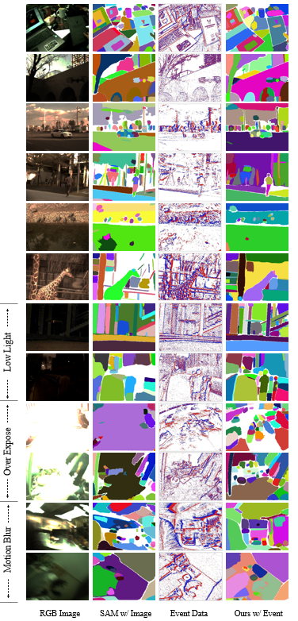
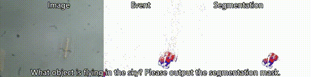
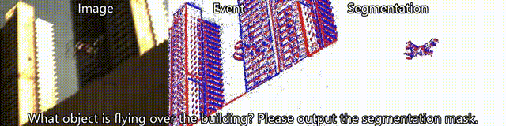
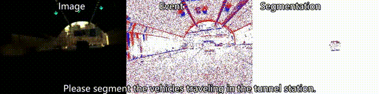
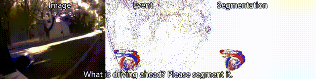
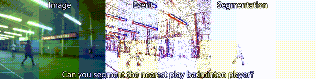
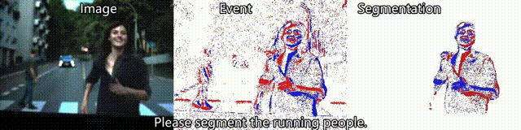

<p align="right">English | <a href="./README_CN.md">简体中文</a></p>

[](https://paperswithcode.com/sota/event-based-object-segmentation-on-rgbe-seg)
[](https://paperswithcode.com/sota/event-based-object-segmentation-on-mvsec-seg)

[](https://paperswithcode.com/sota/event-based-object-segmentation-on-ddd17-seg)
[](https://paperswithcode.com/sota/event-based-object-segmentation-on-dsec-seg)

<div align="center">
  
  <h3 align="center"><strong>Segment Any Event Streams via Weighted Adaptation of Pivotal Tokens [CVPR '24] </strong></h3>
    <p align="center">
    <a>Zhiwen Chen</a><sup>1</sup>&nbsp;&nbsp;
    <a>Zhiyu Zhu</a><sup>2</sup>&nbsp;&nbsp;
    <a>Yifan Zhang</a><sup>2</sup>&nbsp;&nbsp;
    <a>Junhui Hou</a><sup>2</sup>&nbsp;&nbsp;
    <a> Guangming Shi</a><sup>1</sup>&nbsp;&nbsp;
    <a>Jinjian Wu</a><sup>1</sup>
    <br>
    <sup>1</sup>Xidian University&nbsp;&nbsp;&nbsp;
    <sup>2</sup>City University of Hong Kong&nbsp;&nbsp;&nbsp;
</div>

<p align="center">
  <a href="https://arxiv.org/abs/2312.16222" target='_blank'>
    
  </a>
  
  <a href="" target='_blank'>
    
  </a>
</p>

##  About
Official Code for Segment Any Event Streams via Weighted Adaptation of Pivotal Tokens. This paper delves into the nuanced challenge of tailoring the Segment Anything Models (SAMs) for integration with event data, with the overarching objective of attaining robust and universal object segmentation within the event-centric domain. 
<div align="center">
  
</div>


##  Getting Started

###  Installation
Clone the repository locally:
```
pip install git+https://github.com/happychenpipi/EventSAM.git
```

Create and activate a conda environment and install the required packages:
```
conda create -n eventsam python=3.8
conda activate eventsam
bash install_eventsam.sh
```

### 📈 Data Preparation
In this work, we collected a large-scale RGB-Event dataset for event-centric segmentation, from current available pixel-level aligned datasets ([VisEvent](https://sites.google.com/view/viseventtrack/) and [COESOT](https://github.com/Event-AHU/COESOT)), namely RGBE-SEG. To explore the zero-shot performance of our method, we showed more segmentation results on [MVSEC](https://daniilidis-group.github.io/mvsec/), [DDD17](https://pkuml.org/resources/pku-ddd17-car.html) and [DSEC](https://dsec.ifi.uzh.ch/) datasets. In addition, we also provide corresponding groundtruth masks or prediction results for comparison. Please download these data with the link below and put in ./data.
<a href="https://pan.baidu.com/s/19ruTHhwtzzVlFG0j-cO19A?pwd=4ek2" target='_blank'></a> <a href="https://pan.baidu.com/s/19-JwiJsMWxz4czaxNwXeSQ?pwd=uq4x" target='_blank'></a> <a href="https://pan.baidu.com/s/1kh_6hFgyuDw04bDQLc9O_w?pwd=hn6m" target='_blank'></a>

Format of All Datasets:
```Shell
├── RGBE_SEG dataset
    ├── Training Subset (472 sequences)
        ├── dvSave-2021_09_01_06_59_10
            ├── event          # Event Source File： [N,4]-[x,y,t,p]
            ├── rgb_image      # RGB Images, which is the input of teacher network.
            ├── event_image    # Event-oriented Binary Images, which is used for event visualization.
            ├── voxel_image    # Event-oriented Voxel-like Images, which is the input of student network.
        ├── ... 
    ├── Testing Subset For Normal Scenes (104 sequences) # Easy, Medium, Hard
        ├── dvSave-2021_07_30_11_04_12
            ├── event
            ├── rgb_image
            ├── event_image
            ├── voxel_image 
        ├── ...
    ├── Testing Subset For Degraded Scenes (28 sequences) # Low Light, Over Exposure, Motion Blur
        ├── video_0078
            ├── event
            ├── rgb_image
            ├── event_image
            ├── voxel_image 
        ├── ...

├── MVSEC_SEG/DDD17_SEG/DSEC_SEG dataset
    ├── Testing Subset
        ├── seq_name
            ├── event
            ├── rgb_image
            ├── event_image
            ├── voxel_image 
        ├── ...

```

Format of Groundtruth Masks or Prediction Masks:
```Shell
├── RGBE_SEG dataset
    ├── Testing Subset For Normal Scenes (108 sequences) # Easy, Medium, Hard
        ├── dvSave-2021_07_30_11_04_12
            ├── **.png     # Groundtruth Masks/Prediction Masks.
        ├── ...

├── MVSEC_SEG/DDD17_SEG/DSEC_SEG dataset
    ├── Testing Subset
        ├── seq_name
            ├── **.png     # Groundtruth Masks/Prediction Masks.
        ├── ...
```


## 🚀 Training
First download a pre-trained model checkpoint (e.g. sam_vit_b.pth) [SAM](https://github.com/facebookresearch/segment-anything/tree/main) and put in ./pretrained. Then the model can be used as teacher for rgb-event knowledge distillation:

```
python ./event_encoder/train.py
```

##  Pre-trained Model
Pre-trained EventSAM model (e.g. rgbe_encoder.pth) needs to be downloaded and put in ./checkpoints.  <a href="https://pan.baidu.com/s/1mFtvLAkHFpnGmx_8Ky85kQ?pwd=3c3e" target='_blank'></a>


##  Evaluation
Predict the segment masks of event images:
```
python ./evaluate/predict_mask.py
```

Calculate metrics of predicted masks:
```
python ./evaluate/calculate_metric.py
```

##  Visualization
<div align="center">
  
</div>

##  EventSAM&LLM
To further validate the strong zero-shot object recognition ability of our event-adapt SAM. We integrate it with a vision-language object segmentation framework [LISA](https://github.com/dvlab-research/LISA). Through this, we could further unlock the rich semantic inherent in SAM, for interactive universal object segmentation with Event data. There are some visualizations.
<div align="center">
    
    
    
</div>

##  Acknowledgments
Thanks to [VisEvent](https://sites.google.com/view/viseventtrack/), [COESOT](https://github.com/Event-AHU/COESOT), [MVSEC](https://daniilidis-group.github.io/mvsec/), [DDD17](https://pkuml.org/resources/pku-ddd17-car.html), [DSEC](https://dsec.ifi.uzh.ch/) datasets, [SAM](https://github.com/facebookresearch/segment-anything/tree/main) and [LISA](https://github.com/dvlab-research/LISA) projects.

##  Contact
Feedbacks and comments are welcome! Feel free to contact us via [zhiwen.chen@stu.xidian.edu.cn](zhiwen.chen@stu.xidian.edu.cn) and [zhiyuzhu2-c@my.cityu.edu.hk](zhiyuzhu2-c@my.cityu.edu.hk). 

## 📚 Citation
If you use EventSAM in your research, please use the following BibTeX entry.

```
@InProceedings{Chen_2024_CVPR,
    author    = {Chen, Zhiwen and Zhu, Zhiyu and Zhang, Yifan and Hou, Junhui and Shi, Guangming and Wu, Jinjian},
    title     = {Segment Any Event Streams via Weighted Adaptation of Pivotal Tokens},
    booktitle = {Proceedings of the IEEE/CVF Conference on Computer Vision and Pattern Recognition (CVPR)},
    month     = {June},
    year      = {2024},
    pages     = {3890-3900}
}
```

